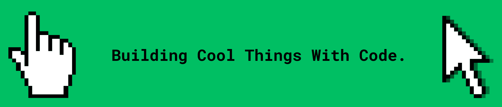

## 👋Hi, I'm Tanay Mishra

### Technologies

---

### About

- 🇮🇳 Based in Mumbai, India
- 🎓 Student passionate about software engineering and open source
- 🛠 Building developer tools, web applications, and mathematical software
- 📚 Interested in systems programming, developer experience, and computer science

---

### Projects

- [Lessel](https://github.com/Terminay/lessel): A framework as an npm package for creating systems of communication between messaging apps.
- [kJudge](https://github.com/Terminay/kJudge): A CLI tool for competitive programmers that has a quick stress testing and judging system.
- [IPLp](https://github.com/Terminay/IPLp): An ML model made for predicting IPL matches trained on previous year data from 2008 to 2024.
- [Leanpass](https://github.com/Terminay/leanpass): A Lightweight PyPi library for small neural networks and educational experiments.
- [Forj128](https://github.com/Terminay/forj128): A 128-bit cryptographic hash function demonstrating Merkle-Damgard construction.
- [Repovibes](https://github.com/Terminay/repovibes): A WebApp which generates a radar looking embeddable svg for your github repos.
  
> Note: All these projects are Open-source and being continuously developed

<b> Kindly ⭐ all the mentioned repositories to support me in development, and also because it's free of cost and helps people! </b>

---

### Contact

<b> You could also FOLLOW me here on GitHub! 🫡 </b>

<picture>
  <source media="(prefers-color-scheme: dark)" srcset="https://raw.githubusercontent.com/Terminay/Terminay/main/dist/pet.svg">
  <source media="(prefers-color-scheme: light)" srcset="https://raw.githubusercontent.com/Terminay/Terminay/main/dist/pet-light.svg">
  
</picture>
